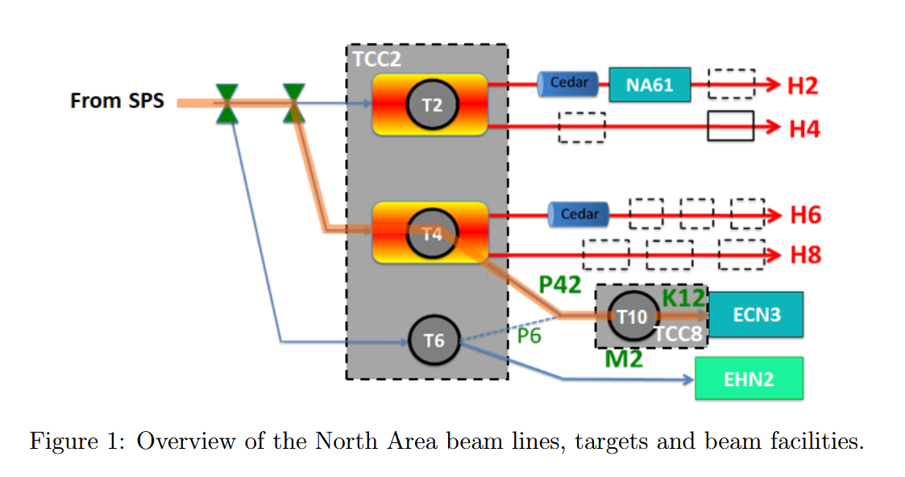

# Overview of BDF/SHiP at ECN3

## 1 Beam dump facility

Only most relevant aspect of implementation in ECN3 is documented here. See references for detail in TCC8 and ECN3. 

* optimal condition for BDF/SHiP is 400GeV proton beam and slow extraction of the protons spills per second
* SPS serves LHC together used up to 1.5E+19 protons per year. Since completion of CNGS project in 2013, up to 4E+19 protons per year at 400GeV and proton spills is unused. 