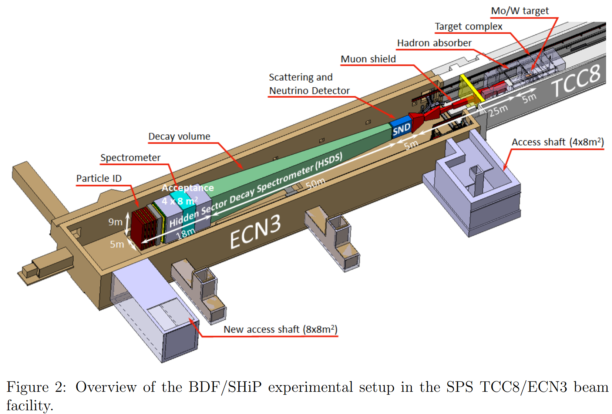
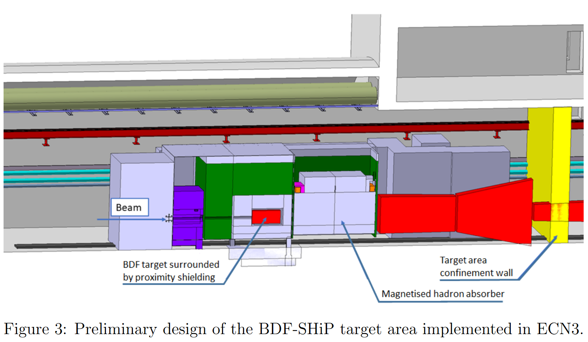
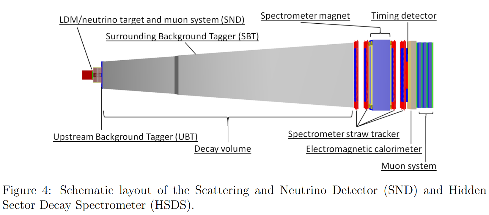

# Overview of BDF/SHiP at ECN3

## 1 Beam dump facility

Only most relevant aspect of implementation in ECN3 is documented here. See references for detail in TCC8 and ECN3.

* optimal condition for BDF/SHiP is 400GeV proton beam and slow extraction of the protons spills per second
* SPS serves LHC together used up to 1.5E+19 protons per year. Since completion of CNGS project in 2013, up to 4E+19 protons per year at 400GeV and proton spills is unused.
* Keywords:
  * North Area = Largest fixed target area in CERN
  * TCC8 = Target Control Cavern 8
  * T2, T4, T6 = located in TCC, serves different beams for H2, H4, H8, etc beam lines by intercepting a fraction of current primary proton beam
  * ECN3 = Experimental Cavern North 3, final destination of K12 beam line
  * EHN2 = Experimental Hall North 2
  * K12 = Kaon line 12, used by NA62
  * M2 = Muon line 2, used by COMPASS
  * BDF = Beam dump facility
  * CDS = Comprehensive Design Study
  * FLUKA Monte Carlo simulations = for radiation protection studies
* At upstream end of TCC8, magnets of BDF dilution system would be used to span the length of TCC8 towards BDF/SHiP proton target, ~130m drift distance to increase beam size and develop dilution pattern on target's front face.

* Overall setup
  * Target Complex
    * --> high density proton target: beam dump and absorber
    * --> hadron absorber: part of overall shielding completely surrounding the target system
    * --> magnetic muon shield: deflects the muon produced in the beam dump to reduce flux in detector acceptance to an acceptable level
      * design experience in CDS phase, simplification in shielding for underground, helium vessel contains the proton target and can be substituted to nitrogen of vacuum
      * maximize production of heavy flavoured hadrons and photons and provide clean background by making target long and combination of material of highest possible atomic mass/number, and optimized for maximum density with a minimum space taken by internal cooling, design require no modification to ENC3
      * blocks of titanium-zirconium-doped molybdenum alloy, minimum 5mm gaps for cooling,
      * hadron absorber: 5 meters long, iron made, absorb hadrons and EM radiation from proton target, equipped with magnetic coil to serve as first section of active muon shield
      * rest of muon shields are free-standing magnetics
      * target complex and part of free-standing muon shield at the end of TCC8 target hall and subsequent muon shield magnets in ECN3 experimental hall

## 2 SHiP detector

Dual system of complementary apparatus:

* Scattering and Neutrino Detector (SND): upstream, designed to search of LDM (Light Dark Matter) scattering and perform neutrino physics
* Hidden Sector Decay Search (HSDS): downstream, designed to reconstruct decay vertices of FIPs (Feebly Interacting Particles), measuring invariant mass and providing particle identification of the decay products in nearly zero background environment

SND Detector:

* LDM/neutrino target with vertexing capability in form of tungsten plates alternated with emusion films and fast electronic detector planes
* target region was magnetised to enable momentum and charge measurements of muons and charged pions and kaons
* muon identiication system
* electronic detector plane in target region are based on scintillating fibres and have 50μm spacial resolution and single plane 400ps time resolution. Allow reconstructing the shower produced by recoil electrons in LDM scattering to determine the initial particle angle and energy.
* nuclear emulsion provide topological discrimination of LDM interaction against the neutrino-induced background events. Emulsion allow detecting tau leptons and charmed hadrons by disentangling their production and decay vertices with sub-micrometeric position and milliradian angular resolution
* SND muon system designed to identify muons produced in the $\nu_\tau$ interaction in the golden mode $\tau \rarr \mu \nu_\tau \bar{\nu_\mu}$ at high efficiency.
* Magnet around LDM/neutrino target to distinguish between $\nu_\tau$ and anti-$\nu_\tau$ by reconstructing charge in the $\tau$ decays to hadroinc final states, and measure momenta of pions and kaons for total hadronic energy measurements

HSDS detector

* measure both fully reconstructable decaus of FIPs and partially reconstructable decays of neutrinos in the final state in a 50m long decay volume of a pyramidal frustum shape

Large spectrometer

* straw tracker: accurately reconstruct the decay vertex, the mass and impact parameter of the reconstructed FIP trajectory at the proton target.
* spectrometer dipole magnet: provide total field integral of about 0.5Tm. Initial design is normal-conducting coil, CDS phase started a study of a type of high-temperature superconductor-based design aimed providing same field gradient

  * > R&D programme started [164] Private communication A. Devred, G. de Lellis, R. Jacobsson, 2021 - 2022.
    >
* Electromagentic calorimeter (ECAL) and a muon detector:

  * provide particle identification, discriminate wide range of models with FIPs and information on background rejection.
  * A scintillator/lead sampling calorimeter, consisting two parts of $3X_0$ and $17X_0$, mechanically separated by 1m longitudinal.
  * Measure the shower axes and allow reconstructing the vertex of $ALP \rarr \gamma \gamma$ decays and the invariant mass by high spacial resolution layer.
* Muon system: four tations interleaved by three muon filters
* Key feature is to ensure efficient control and suppression of different backgrounds

  * background from neutrino interacting within the decay volume eliminated by maintaining decay volume pressure to ~ 1 mbar.
  * decay volume wall is intrumented upstream and on the side of high-efficiency background taggers to provide regional veto against muon and neutrino interaction in verssel wall and against particles entering from outside
  * tagger covering the surrounding wall (SBT) are based on liquid scintillator system segmented in cell of 30cm thickness. 45 MeV energy deposition threshold, >99% efficiency and ~ns time resolution.
  * tagger on the upstream vessel wall (UBT) is based on two 6-layer MRPCs (Multi-gap Resistive Plate Chamber), 100ps resolution, 98% efficiency and ~ 2mm spatial resolution.
  * timing detector located between last spectrometer tracker plane and ECAL to provide a measure of time coincidence to reject combinatorial backgrounds. Based on scintillating bars and time resolution ~100ps.

## Detector revision and implementations in ECN3 

The suppression of physics background in SHiP is based on a combination of minimising the beam-induced particle rates in the detector acceptance by the highly optimised target design, hadron absorber and muon shield, and rejecting residual backgrounds by applying veto taggers, temporal, spatial and kinematics cuts, and particle identification in the detector.

* in CSD phase, emphasis working point on muon shield and loose selection criteria on detectors --> high redundancy on background supression
* revision: smaller ECN3 hall, shift working point for combined background supression towards higher reliance on detector, particularly the veto system
* reduced length of muon shield --> reduced aperture of HSDS spectrometer

## Questions 

1. how does the veto system (veto tagger) and particle identification work? How does it tag the particle and identify the particle? by charge and energy? 